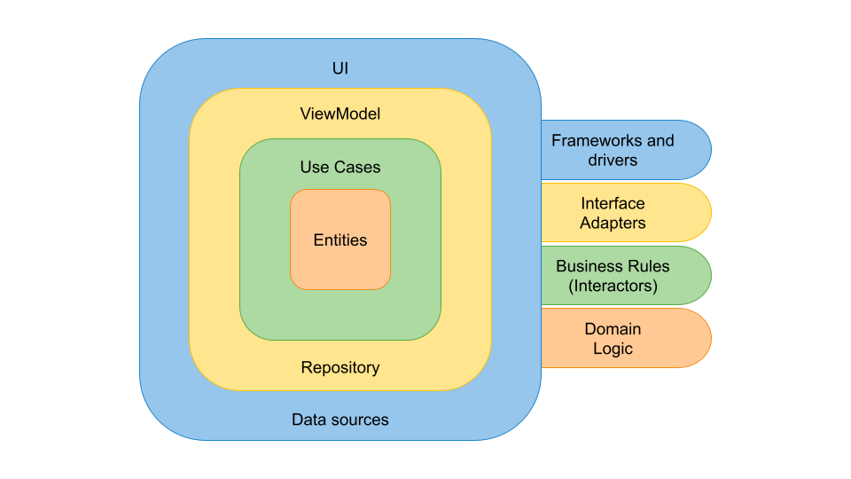
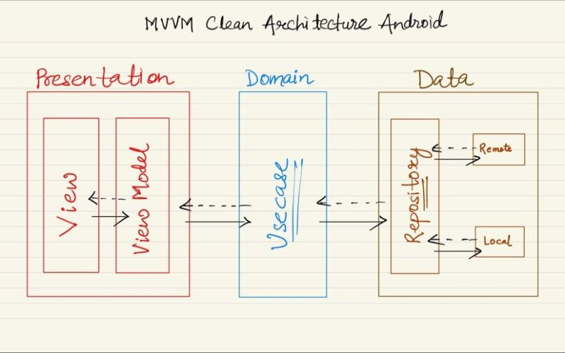

# Rick and Morty App


**Rick and Morty App** is a simple application that consumes the rick and morty api.


## Installation
Clone this repository and import into **Android Studio**

##### Clone with SSH
```bash
> git clone git@github.com:JulioNavarroAnguita/TheRickAndMortyApp.git
```

##### Clone with HTTPS
```bash
> git clone https://github.com/JulioNavarroAnguita/TheRickAndMortyApp.git
```

## Architecture and project organization
To approach the development of this sample application, I have decided to use a class hierarchy based on [**Clean Architecture**](https://blog.cleancoder.com/uncle-bob/2012/08/13/the-clean-architecture.html), an increasingly popular concept thanks to Robert C. Martin (Uncle Bob).



### Class hierarchy
Among the different implementations for Android applications of the aforementioned paradigm, there are remarkable contributions such as the ones from [Antonio Leiva](https://antonioleiva.com/clean-architecture-android/) and [Fernando Cejas](https://fernandocejas.com/2014/09/03/architecting-android-the-clean-way/). Precisely, this latter work has served as the main inspiration for this application architecture.



The previous idea of ​​Rick and Morty App is the separation of layers of concern. Each of these entities is in charge of certain responsibilities, which are handled in isolation. These layers are interconnected thanks to interfaces, which allow achieving the necessary abstraction between them.

* **Presentation**
The functions of this layer consist of managing the events caused by user interactions and rendering the information coming from the domain layer. In this particular case, I have chosen to use the Model-View-ViewModel (MVVM) architecture pattern. This entity "sees" the domain layer.
* **Domain**
This layer is in charge of the business logic of the application. It is based on use cases and repositories (repository pattern). The domain layer obtains data from the data module, uses it to perform all required operations, and formats the results and then delivers them to the presentation layer. This entity only contains Kotlin code and therefore the tests should only consist of unit tests. This layer represents the innermost entity and therefore does not "see" anyone but itself.
* **Data**
This layer simply contains libraries and frameworks that provide data to the application (data sources). Among them, service query frameworks (Retrofit), local databases (Room), event tracking (Omniture), etc. stand out. This layer "sees" the domain layer.

The use of this class hierarchy and package organization aims to understand SOLID principles, become more flexible when implementing new functionality, and facilitate code testing.
 
### Inversion of Control
In order to facilitate the interaction between the above described layers, Rick and Morty App uses a service locator. **[Dagger Hilt](https://dagger.dev/hilt/)** is a framework which allows to abstract type injection in a neat and clear manner. 

### Coroutines
Since _multithreading_ has historically been a challenge in Android Development, the team has decided to include [coroutines](https://codelabs.developers.google.com/codelabs/kotlin-coroutines/#0). This is one of the most interesting and appealing features recently introduced in Kotlin.


### Testing

As one main aspect in the current state-of-the-art in software development, **Rick and Morty App** does include a good number of Unit Tests and a few Instrumentation Tests. The former cover the *domain* and *data* layers, whereas the latter are included in the *presentation* layer.

## Maintainers
This project is mantained by:
* [Julio Navarro Anguita](https://github.com/JulioNavarroAnguita)
